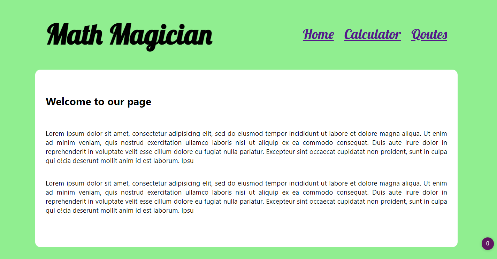

# Calculator App

this is a calculator app built for Math-magicians Inc a fictional company using create-react-app



Additional description about the project and its features.

## Built With

- Javscript
- React
- Prop-types
- Big.js

## Live Demo

[Live Demo Link](https://my-calculatur.herokuapp.com/)

## Getting Started

**This is an example of how you may give instructions on setting up your project locally.**
**Modify this file to match your project, remove sections that don't apply. For example: delete the testing section if the currect project doesn't require testing.**

To get a local copy up and running follow these simple example steps.

### Prerequisites

This app requires Nodejs. if you don't have it installed yet, install it and do the following
commands in your terminal.

### Prerequisites

NodeJs

### Setup

- Clone this repository with: git clone `https://github.com/Davidosky007/my_calculator.git` using your terminal or command line.

- Change to the project directory by entering cd "my_calculator" in the terminal

- Next run npm install to install the necessary dependencies

- Finally run 'npm start' to start the application

### Usage

Start server with:

```
    npm start
```

### Run tests

```
npm test
```

### Deployment
Heroku
## Author

👤 **David Bassey**

- GitHub: [@davidosky007](https://github.com/davidosky007)
- Twitter: [@davidosky2](https://twitter.com/Davidosky2)
- LinkedIn: [David Bassey](https://www.linkedin.com/in/david-bassey-akan/)

## 🤝 Contributing

Contributions, issues, and feature requests are welcome!

Feel free to check the [issues page](https://github.com/Davidosky007/my_calculator/issues).

## Show your support

Give a ⭐️ if you like this project!

## Acknowledgments

- Microverse
- My Standup Team

## 📝 License

This project is [MIT](lic.url) licensed.
